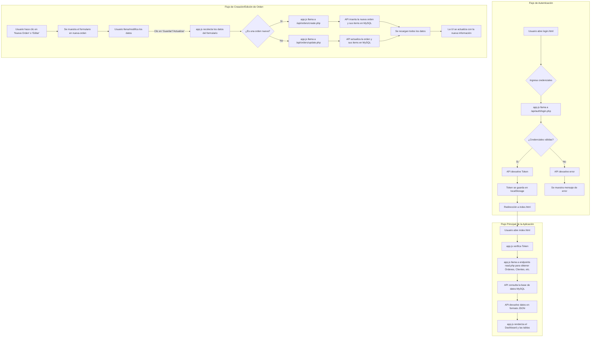

# Documentación Funcional del Gestor de Órdenes de Servicio

## 1. Introducción

Este documento describe la funcionalidad del sistema "Gestor de Órdenes de Servicio". El propósito de la aplicación es permitir la gestión integral de órdenes de servicio para un taller, abarcando desde la autenticación de usuarios hasta la creación, visualización, edición y seguimiento de órdenes.

El sistema está construido con una arquitectura cliente-servidor, utilizando un frontend basado en HTML, TailwindCSS y JavaScript puro, y un backend en PHP que se comunica con una base de datos MySQL.

## 2. Características Principales

### 2.1. Autenticación de Usuarios

-   **Inicio de Sesión y Registro**: El sistema cuenta con una página de acceso (`login.html`) donde los usuarios pueden iniciar sesión con su correo y contraseña o crear una nueva cuenta.
-   **Seguridad basada en Token**: Una vez que el usuario inicia sesión, la API genera un token de autenticación (JWT) que se almacena en el navegador. Este token se envía en cada solicitud posterior a la API para verificar la identidad del usuario y asegurar el acceso a los datos.
-   **Cierre de Sesión**: El usuario puede cerrar su sesión, lo que elimina el token del navegador y lo redirige a la página de inicio de sesión.

### 2.2. Dashboard (Panel de Control)

Es la pantalla principal (`index.html`) después de iniciar sesión. Ofrece una vista general del estado del negocio a través de:

-   **KPIs (Indicadores Clave de Rendimiento)**:
    -   **Total Ingresado**: Suma de los montos totales de todas las órdenes.
    -   **Ticket Promedio**: Ingreso total dividido por el número de órdenes.
    -   **Total de Órdenes**: Conteo total de órdenes registradas.
-   **Gráficas**:
    -   **Órdenes por Estado**: Un gráfico de dona que muestra la distribución de las órdenes según su estado actual (Recibido, En reparación, Pagado, etc.).
    -   **Ingresos por Mes**: Un gráfico de barras que muestra los ingresos totales para cada uno de los últimos 12 meses.
-   **Tablas Resumen**:
    -   **Órdenes Pendientes de Pago**: Muestra las 10 órdenes más antiguas que no han sido marcadas como "Entregado Pagado".
    -   **Órdenes Pagadas**: Muestra las 10 órdenes más recientes que ya han sido pagadas.

### 2.3. Gestión de Órdenes de Servicio

Esta es la funcionalidad central del sistema.

-   **Creación de Órdenes**:
    -   Desde la pestaña "Nueva Orden", el usuario puede llenar un formulario detallado que incluye:
        -   **Número de Orden**: Se autocompleta con el siguiente número consecutivo, pero puede ser modificado.
        -   **Datos del Cliente**: Nombre, teléfono, dirección, RFC y email.
        -   **Datos del Vehículo**: Marca/Modelo, placas, año, kilometraje y nivel de gasolina.
        -   **Conceptos**: Una lista dinámica de refacciones y mano de obra, donde se puede especificar cantidad, descripción, precio unitario y precio total.
        -   **Observaciones**: Un campo de texto libre para anotaciones adicionales.
        -   **Estado de la Orden**: Un selector para definir el estado actual del servicio.
        -   **Cálculos de Totales**: El sistema calcula automáticamente el subtotal, IVA y total, y permite registrar anticipos.
-   **Visualización (Historial)**:
    -   La pestaña "Historial de Órdenes" muestra una tabla con todas las órdenes registradas.
    -   La tabla es interactiva: permite **buscar** por cliente, vehículo, etc., y **ordenar** las columnas.
    -   Desde aquí se pueden disparar las acciones de Editar, Imprimir o Eliminar.
-   **Actualización (Edición)**:
    -   Al hacer clic en "Editar", el sistema carga los datos de una orden existente en el mismo formulario de "Nueva Orden", permitiendo modificar cualquier campo.
-   **Eliminación**:
    -   Permite eliminar una orden del sistema previa confirmación.

### 2.4. Gestión de Catálogos (Automática)

El sistema maneja catálogos de Clientes, Vehículos e Insumos de forma inteligente y automática:

-   **Clientes**: Si al crear una orden se introduce el nombre de un cliente que no existe, el sistema lo crea automáticamente. Si el cliente ya existe, sus datos se autocompletan.
-   **Vehículos**: De manera similar, se pueden registrar nuevos vehículos asociados a un cliente.
-   **Insumos (Conceptos)**: Si se añade un concepto a una orden que no existe en el catálogo de insumos, se guarda automáticamente para futuras referencias.

### 2.5. Impresión y Exportación

-   **Imprimir Orden**: Genera una vista simplificada y amigable para la impresión de una orden de servicio específica.
-   **Exportar a CSV**: Permite descargar un archivo `.csv` con el historial completo de todas las órdenes y sus detalles.

## 3. Diagrama de Flujo del Sistema

A continuación, se muestra un diagrama que ilustra los flujos de trabajo más importantes de la aplicación.

